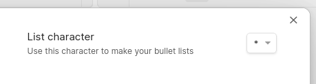
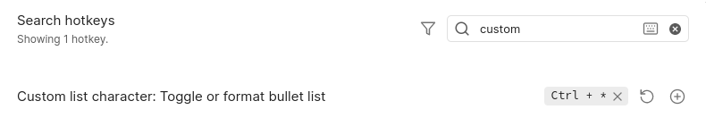
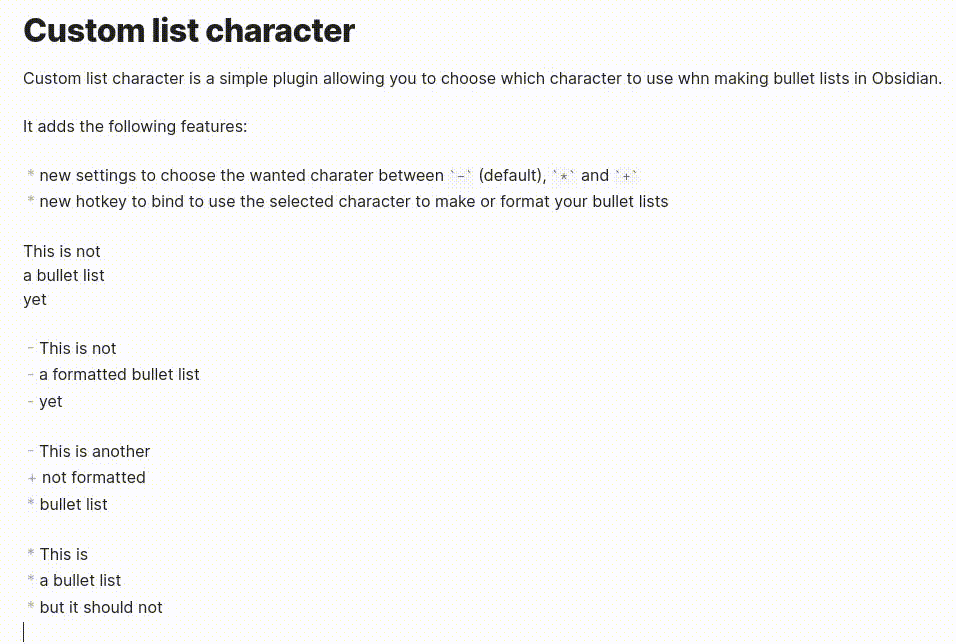

# Custom list character

## Introduction

Custom list character is a simple plugin allowing you to choose which character to use when making bullet lists in Obsidian.

It adds the following features:

* new settings to choose the wanted charater between `-` (default), `*` and `+`
* new hotkey to bind to use the selected character to make or format your bullet lists

## Demo

1. Choose your character!

   

2. Set your hotkeys:

   

3. Use the new hotkey to make and format your bullet lists like so:

## Install the plugin

### Installatin through Obsidian

To install the plugin from Obsidian, follow these steps:

1. Open Obsidian
2. Go to `Settings > Community plugins`
3. Click on `Brownse` in `Community plugins` section
4. Search `Custom list character`
5. Click on the plugin
6. Click on `Install`
7. Come back to `Settings > Community plugins`
8. Refresh you plugins and activate `Custom list character`

### Manual installation

To install the plugin, follow these steps:

1. Download the `main.js` and the `manifest.json` from the [latest release of the project](https://github.com/lilian-pouliquen/obsidian-custom-list-character/releases/latest/)
   * Alternatively, you can download the `custom-list-character.zip` that contains the two above files
2. Place the files in `<your_vault_path>/.obsidian/plugins/custom-list-character/`
3. Open Obsidian
4. Go to `Settings > Community plugins`
5. Refresh you plugins and activate `Custom list character`

## Help on the project

Any help is welcome!

If you want to help me improve the plugin, please fork the project and make a pull request. Do not hesitate to ask features.

## Author

* Lilian POULIQUEN – [@lilian-pouliquen on GitHub](https://github.com/lilian-pouliquen/)
